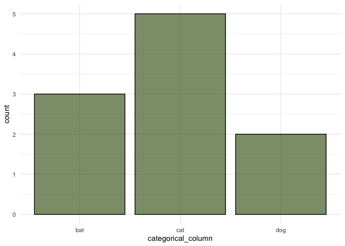
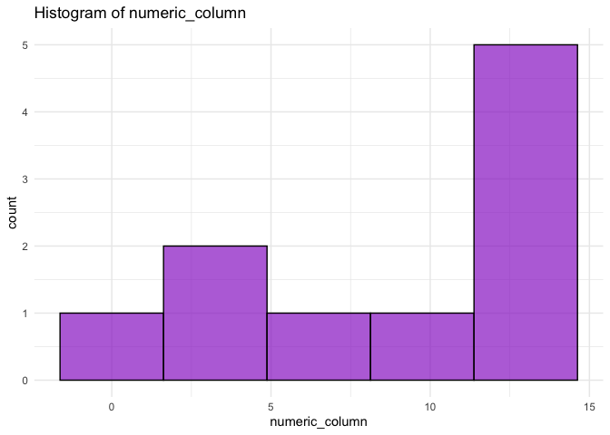

ggplot2 function
================
2024-10-27

``` r
library(ggplot2)

#' TITLE: generate ggplot2 visualization
#' Generates a ggplot visualization based on the type of the specified column. 
#' If the column is numeric, it creates a histogram. If the column is categorical, it creates a bar chart.
#'
#' @param data a dataframe containing the column to be plotted. The df must include the specified `column`. Named it this to clearly refer to the data that the user is working with.
#' @param column string representing the column name to be plotted. Named it this to clearly refer to the column they want to visualize
#' @param bins numeric value specifying the number of bins for the histogram; only used if the column is numeric. Default = 30 but the user can specify whatever they like. Named it this to specifically refer to the number of bins used
#' @param fill_color string representing the fill color of the plot bars/points.  Named it this to refer to the fill colour the user wants. 
#' @param ... Additional arguments to pass to the `geom_histogram()` or `geom_bar()` functions
#' 
#' @return the ggplot object created based on the column type.

create_ggplot <- function(data, column, bins = 30, fill_color = "steelblue", ...) {
  if (!column %in% names(data)) { # provides error message if column doesn't exist in df
    stop("The specified column does not exist in the dataframe.") 
  }
  is_numeric_col <- is.numeric(data[[column]]) # checking for numeric column
  
  if (is_numeric_col) { # column is numeric, make a histogram
    plot <- ggplot(data, aes_string(x = column)) +
      geom_histogram(
        bins = bins,
        fill = fill_color,
        color = "black",  
        alpha = 0.7,
        size = 0.5, 
        ...
      ) +
      theme_minimal() +
      ggtitle(paste("Histogram of", column))
  } else { # column is not numeric, make a bar chart
    plot <- ggplot(data, aes_string(x = column)) +
      geom_bar(
        fill = fill_color,
        color = "black", 
        alpha = 0.7,
        ...) +
      theme_minimal()
      ggtitle(paste("Bar chart of", column))
  }
  
  return(plot) # returns ggplot2 object
}
```

Set up for examples - creating df:

``` r
df <- data.frame(
  categorical_column = factor(c("cat", "bat", "cat", "cat", "dog", "cat", "bat", "dog", "cat", "bat")),
  numeric_column = c(1, 2, 3, 10, 14, 14, 12, 12, 12, 8)
)
```

Example 1: creating a scatterplot with a numeric column

``` r
categorical_plot <- create_ggplot(df, "categorical_column", fill_color = "darkolivegreen")
```

    ## Warning: `aes_string()` was deprecated in ggplot2 3.0.0.
    ## ℹ Please use tidy evaluation idioms with `aes()`.
    ## ℹ See also `vignette("ggplot2-in-packages")` for more information.
    ## This warning is displayed once every 8 hours.
    ## Call `lifecycle::last_lifecycle_warnings()` to see where this warning was
    ## generated.

``` r
print(categorical_plot)  # View the plot
```

<!-- -->

Example 2: creating a bar chart with a categorical column

``` r
numeric_plot <- create_ggplot(df, "numeric_column", bins=5, fill_color = "darkorchid")
```

    ## Warning: Using `size` aesthetic for lines was deprecated in ggplot2 3.4.0.
    ## ℹ Please use `linewidth` instead.
    ## This warning is displayed once every 8 hours.
    ## Call `lifecycle::last_lifecycle_warnings()` to see where this warning was
    ## generated.

``` r
print(numeric_plot)  # View the plot
```

<!-- -->

Example 3: handling a non-existent column (will raise an error)

``` r
plot3 <- create_ggplot(df, "non_existent_column", fill_color = "blue")
```

    ## Error in create_ggplot(df, "non_existent_column", fill_color = "blue"): The specified column does not exist in the dataframe.

Testing the function

``` r
library(testthat)

# Test suite
test_that("create_ggplot function works without errors", {
  
  # Test 1: The function should return a ggplot object for a categorical column
  plot_cat <- create_ggplot(df, "categorical_column")
  expect_s3_class(plot_cat, "ggplot")
  
  # Test 2: The function should return a ggplot object for a numeric column
  plot_num <- create_ggplot(df, "numeric_column", bins=5)
  expect_s3_class(plot_num, "ggplot")
  
  # Test 3: The function should throw an error when the specified column does not exist
  expect_error(
    create_ggplot(df, "non_existent_column"),
    regexp = "The specified column does not exist in the dataframe"
  )
  
  # Test 4: Check if the function handles NA values appropriately
  df_na <- df
  df_na$numeric_column[2] <- NA  
  plot_na <- create_ggplot(df_na, "numeric_column", na.rm = TRUE)
  expect_s3_class(plot_na, "ggplot")
  
  # Test 5: Check if the function works with an empty df
  empty_df <- data.frame(categorical_column = factor(), numeric_column = numeric(0))
  plot_empty <- create_ggplot(empty_df, "categorical_column")
  expect_s3_class(plot_empty, "ggplot")
  
})
```

    ## Test passed 😸
